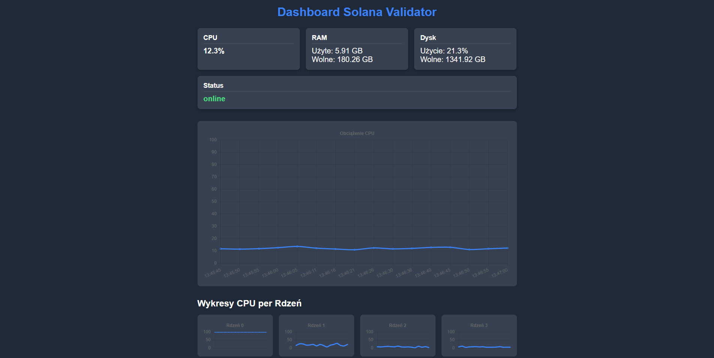
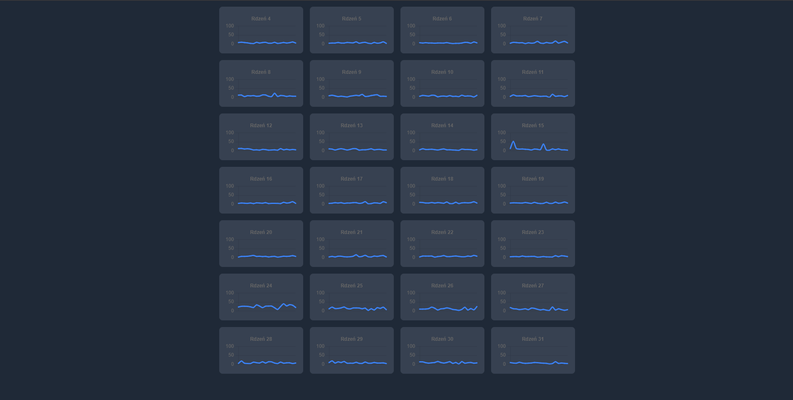

Projekt powstał z myślą o codziennym użytku, do szybkiego sprawdzania działania serwera, na którym postawiony jest walidator na kryptowalucie Solana. 
Oferuje on sprawdzenie działania samego walidatora, aktualnego użycia procesora, aktualnego zużycia ramu oraz dysku. Dodane są wykresy obrazujące historię obciązenia procesora oraz każdego z jego rdzeni.
W przyszłości planuję dodać kolejne CLI solany, aby informacje były jeszcze bardziej uszczegółowione.

# 🛰️ Solana Validator Dashboard

Projekt powstał z myślą o codziennym użytku — do szybkiego i wygodnego sprawdzania działania serwera, na którym uruchomiony jest walidator sieci Solana.

---

## Funkcjonalności

- **Podgląd działania samego walidatora**  
  (m.in. `solana catchup --our-localhost`, `solana epoch-info`)

- **Sprawdzenie aktualnego zużycia zasobów**  
  - CPU  
  - RAM  
  - Dysk

- **Monitorowanie aktywnych procesów**  
  - PID  
  - Użycie CPU i RAM  
  - Użytkownik  
  - Ścieżka do procesu

- **Wizualizacja historii obciążenia CPU**  
  - Całościowe zużycie  
  - Obciążenie każdego rdzenia z osobna

---

## Screeny

---

## Technologie

- **Frontend:** React (Vite + TailwindCSS)
- **Backend:** Flask (Python)  
  - `psutil` do monitorowania zasobów  
  - `subprocess` do wywoływania CLI Solany

---

## Jak uruchomić
- Projekt jest postawiony na domenie: [https://kacperwaszczuk.pl/](https://kacperwaszczuk.pl/dashboard)
  
---

## Plany na przyszłość

W planach jest dodanie kolejnych komend z CLI Solany, aby jeszcze dokładniej monitorować stan węzła i aktywność w sieci.

---
