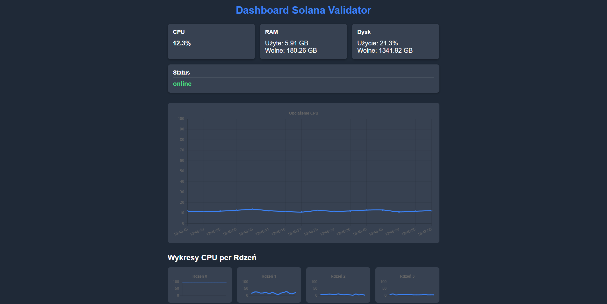
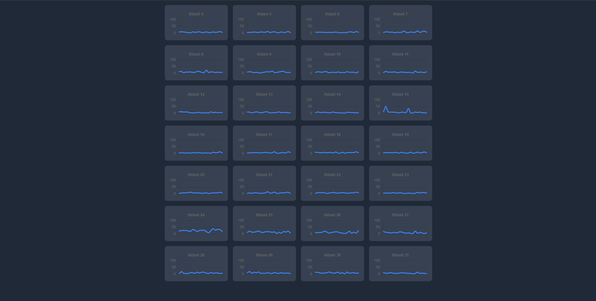

# 💻 Solana Validator Dashboard

Projekt powstał z myślą o codziennym użytku — do szybkiego i wygodnego sprawdzania działania serwera, na którym uruchomiony jest walidator sieci Solana.

---

## Funkcjonalności

- **Podgląd działania samego walidatora**  

- **Sprawdzenie aktualnego zużycia zasobów**  
  - CPU  
  - RAM  
  - Dysk

- **Wizualizacja historii obciążenia CPU**  
  - Całościowe zużycie  
  - Obciążenie każdego rdzenia z osobna

---

## Screeny

---

## Technologie

- **Frontend:** React (Vite + TailwindCSS)
- **Backend:** Flask (Python)  
  - `psutil` do monitorowania zasobów  
  - `subprocess` do wywoływania CLI Solany

---

## Jak uruchomić
- Projekt jest postawiony na domenie: [https://kacperwaszczuk.pl/](https://kacperwaszczuk.pl/dashboard/)
  
---

