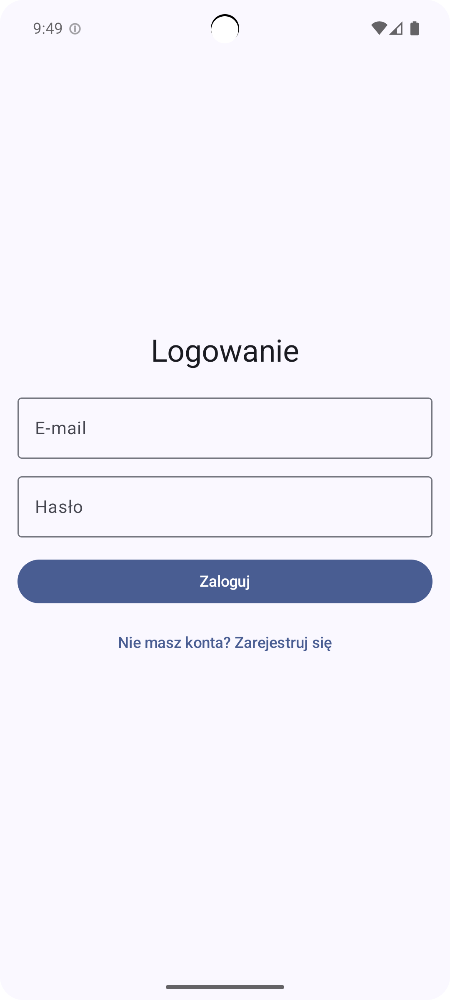
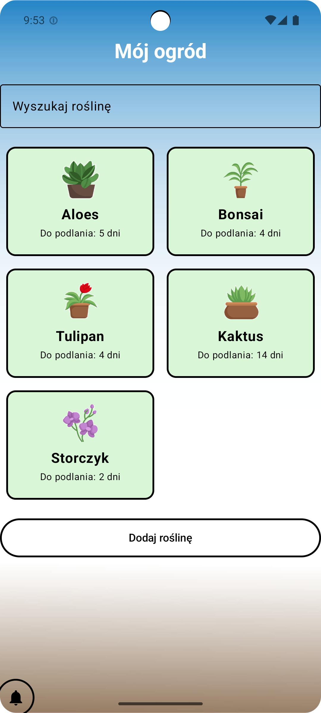
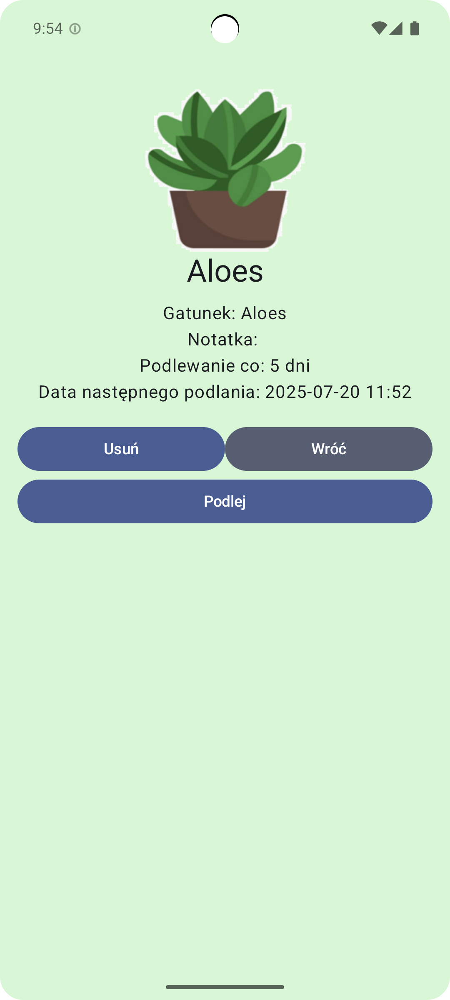
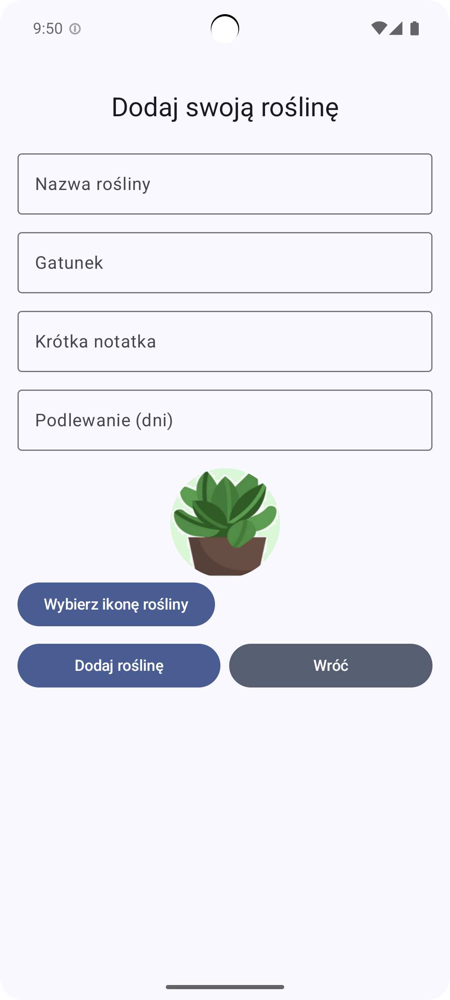

# 🌱 PlantCare

Aplikacja mobilna do zarządzania i podlewania roślin domowych, stworzona w Android Studio z użyciem Kotlin + Jetpack Compose.

## ✨ Funkcje

- Dodawanie własnych roślin
- Ustawianie przypomnień o podlewaniu
- Zdjęcia i opisy roślin
- Obsługa powiadomień

## 📸 Screeny

<table>
  <tr>
    <td><b>Ekran Logowania</b></td>
    <td><b>Ekran Główny</b></td>
    <td><b>Informacje o roślinie</b></td>
    <td><b>Dodawanie Rośliny</b></td>
  </tr>
  <tr>
    <td></td>
    <td></td>
    <td></td>
    <td></td>
  </tr>
</table>

## 🔒 Technologie

- **Kotlin**
- **Jetpack Compose**
- **Firebase Authentication**
- **Firebase Realtime Database**
- **WorkManager**

## 📱 Wymagania

- Android Studio
- Emulator lub telefon z androidem

## 🔧 Jak uruchomić

1. Sklonuj repozytorium:
   ```bash
   git clone https://github.com/xxPesHxx/Portfolio.git
2. Otwórz projekt w Android Studio (Portfolio/PlantCare)
3. Skonfiguruj swój plik Firebase (google-services.json w app/)
4. Uruchom aplikację na emulatorze lub telefonie


