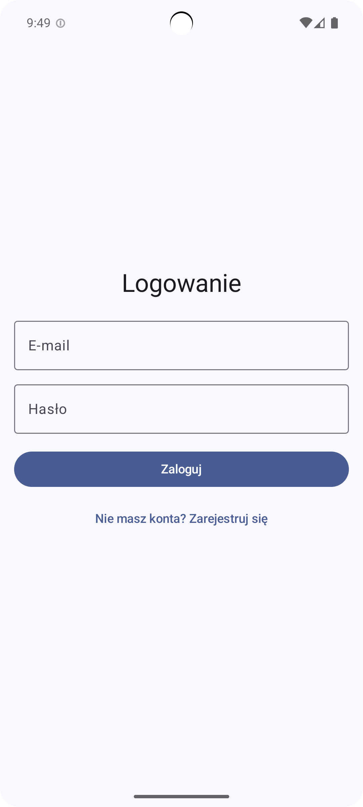
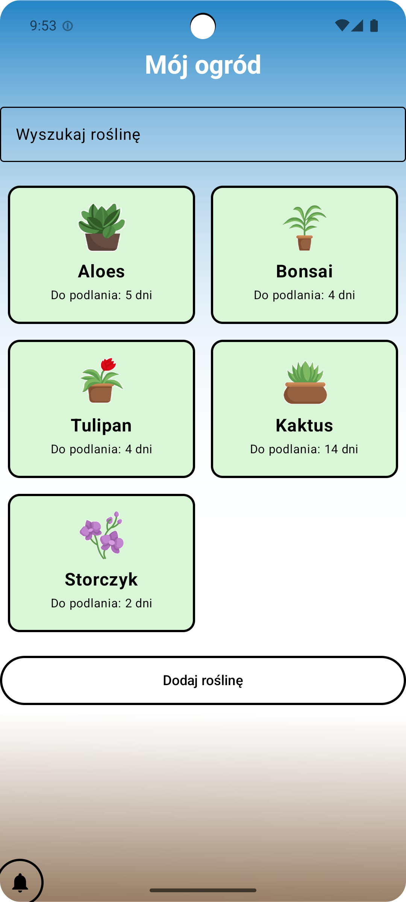
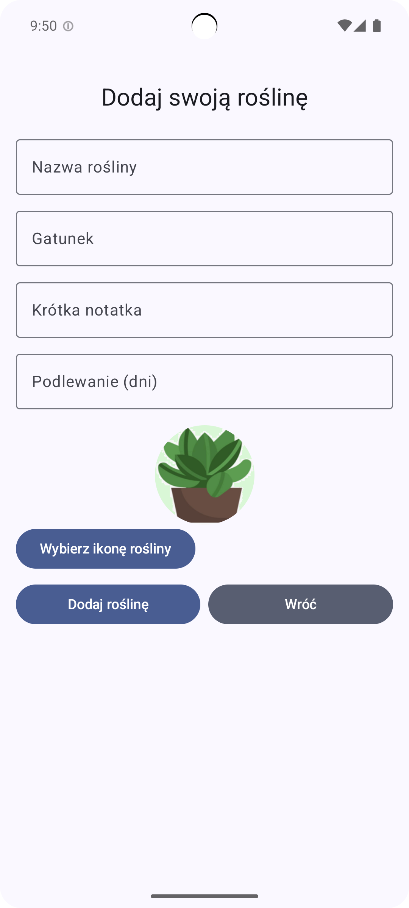
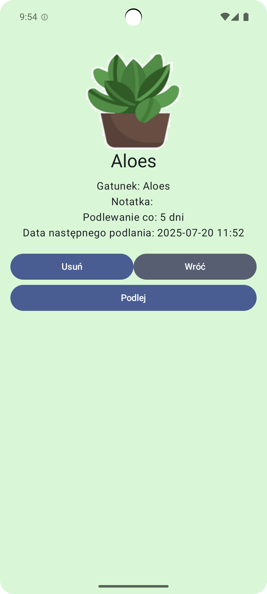

# PlantCare

Aplikacja mobilna do zarządzania i podlewania roślin domowych, stworzona w Android Studio z użyciem Kotlin + Jetpack Compose.

## Funkcje

- Dodawanie własnych roślin
- Ustawianie przypomnień o podlewaniu
- Zdjęcia i opisy roślin
- Obsługa powiadomień

## Screeny



<b><h3>Ekran Logowania</h3></b>                                     
    Umożliwia użytkownikowi zalogowanie się do aplikacji za pomocą Firebase Authentication. 
<br clear="left"/>




<b><h3>Ekran Główny</h3></b><br/>
      Wyświetla wszystkie wcześniej dodane rośliny wraz z nazwą, opisem oraz nastepną datą podlania.  
<br clear="left"/>




<b><h3>Dodawanie Rośliny</h3></b><br/>
      Umożliwia dodanie rośliny wraz z jej gatunkiem, nazwą, opisem, interwałem podlewania oraz jednej z kilku dostępnych ikon.
<br clear="left"/>




<b><h3>Informacje o roślinie</h3></b><br/>
    Wyświetla wszystkie informacje o klikniętej roślinie.
<br clear="left"/>


## Technologie

- **Kotlin**
- **Jetpack Compose**
- **Firebase Authentication**
- **Firebase Realtime Database**
- **WorkManager**

## Wymagania

- Android Studio
- Emulator lub telefon z androidem

## Jak uruchomić

1. Sklonuj repozytorium:
   ```bash
   git clone https://github.com/xxPesHxx/Portfolio.git
2. Otwórz projekt w Android Studio (Portfolio/PlantCare)
3. Skonfiguruj swój plik Firebase (google-services.json w app/)
4. Uruchom aplikację na emulatorze lub telefonie


