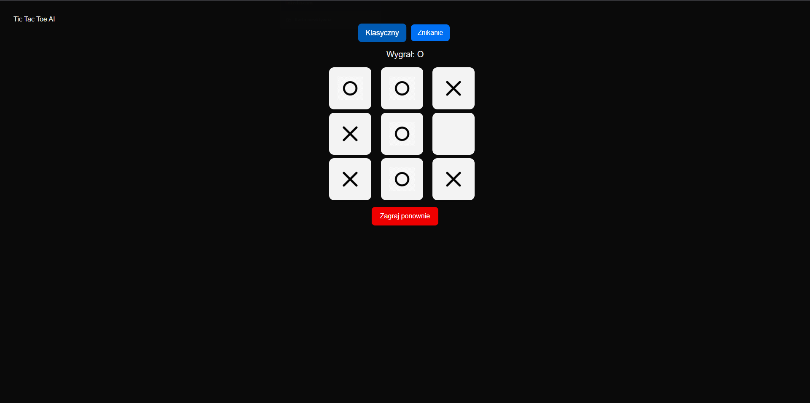
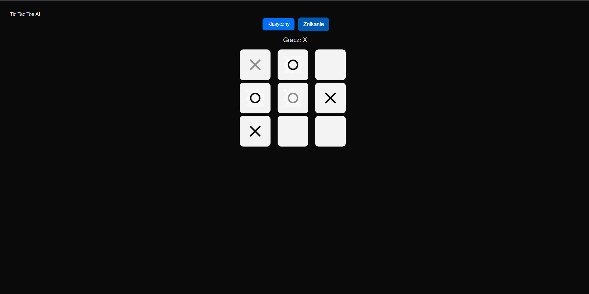

# 🎲 Kółko i Krzyżyk ze sztuczną siecią neuronową
Prosta gra Kółko i Krzyżyk z przeciwnikiem AI, jako aplikacja webowa. Frontend zbudowany w Next.js, backend w Flask z użyciem wytrenowanej sieci neuronowej (MLP w Pythonie).

---

## Funkcjonalności: 
- Gra z wlasnoręcznie napisaną sztuczną inteligencją w Pythonie  
- Dwa tryby gry: Klasyczny lub Tryb ze Znikającymi Ruchami  
- Możliwość restartu rozgrywki w dowolnym momencie
- Licznik wyników: wygrane gracza, AI oraz remisy
- Responsywny interfejs działający na komputerach i urządzeniach mobilnych  

---

## Screeny
| Gra Klasyczna |
|--------------|
|  |

| Gra ze Znikającymi Ruchami |
|--------------|
|  |

---

## Technologie:
- **HTML**, **Next.js**, **CSS Grid** - **Frontend**
- **Flask/Python** - **Backend** 
- **Prosta sieć neuronowa napisana w Pythonie**  

---

## Jak uruchomić
- Projekt jest postawiony na domenie: [https://kacperwaszczuk.pl/](https://kacperwaszczuk.pl/tictactoe)

---

## Struktura Projektu
- **```app.py``` - Plik główny backendu (Flask). Udostępnia API `/api/move`, które odbiera aktualną planszę i zwraca ruch AI.**
- **```main.py``` - Implementacja sieci neuronowej**
- **```tictactoe-web\src\app\tictactoe\TicTacToeBoard.tsx``` - Główny plik frontendu, odpowiada za wyświetlanie planszy i obsługę kliknięć**
